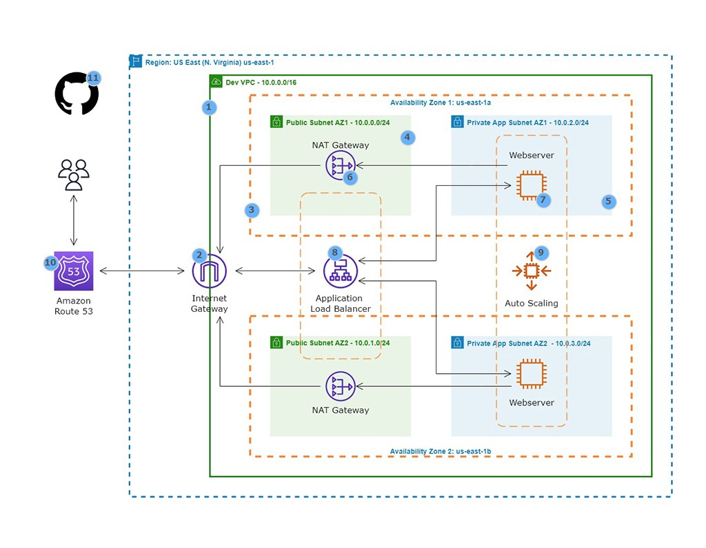

### Hosting a Static Website on AWS


#### 1. Project Overview
This project involves hosting a static HTML web application on Amazon Web Services (AWS). It is designed to showcase a highly available, scalable, and secure infrastructure for web hosting, utilizing several AWS services and features.

#### 2. Architecture
- **VPC Setup**: A VPC with public and private subnets in two availability zones for redundancy and isolation.
- **Internet Gateway**: Allows communication between VPC instances and the internet.
- **Security Groups**: Act as firewalls to regulate traffic.
- **Public Subnet Resources**: NAT Gateway, Bastion Host, and Application Load Balancer.
- **EC2 Instance Connect Endpoint**: For secure connections to public and private subnet resources.
- **Private Subnet Usage**: Hosting of web servers and database servers.
- **NAT Gateway**: Enables private subnet instances to access the internet.
- **EC2 Instances**: Serve the static website.
- **Application Load Balancer**: Balances traffic across EC2 instances.
- **Auto Scaling Group**: Manages EC2 instance scaling for availability and fault tolerance.
- **Route 53**: Domain name registration and DNS management.
- **GitHub Repository**: Stores the deployment scripts and web files.

#### 3. Deployment Script
The bash script for deployment:

```bash
#!/bin/bash
sudo su
yum update -y
yum install -y httpd
cd /var/www/html
wget https://github.com/kronphe/xmen-site-webfiles/raw/main/xmen-main.zip
unzip xmen-main.zip
cp -r /var/www/html/xmen-main/* /var/www/html
rm -rf xmen-main.zip xmen-main
systemctl enable httpd
systemctl start httpd
```

#### 4. Deployment Steps
1. **Set Up AWS Infrastructure**: Configure the VPC, subnets, Internet Gateway, Security Groups, and other AWS resources as per the architecture.
2. **Run Deployment Script**: Execute the provided script on an EC2 instance to deploy the web app.
3. **Verify the Deployment**: Access the deployed website through the EC2 instance's public IP or DNS.

#### 5. Repository Structure
- `Deployment Script`: Contains the deployment script for setting up the web application on the EC2 instances.
- `Architectural Diagram`: Visual representation of the AWS architecture used.

#### 6. Additional Resources
- **AWS Documentation**: For detailed guidance on configuring each AWS service.
- **Security Best Practices**: Recommendations for securing AWS resources.
- **Scaling Strategies**: Guidelines on scaling the infrastructure to handle varying traffic.
- **Monitoring and Logging**: Tools and techniques for monitoring the health and performance of the application and infrastructure.

